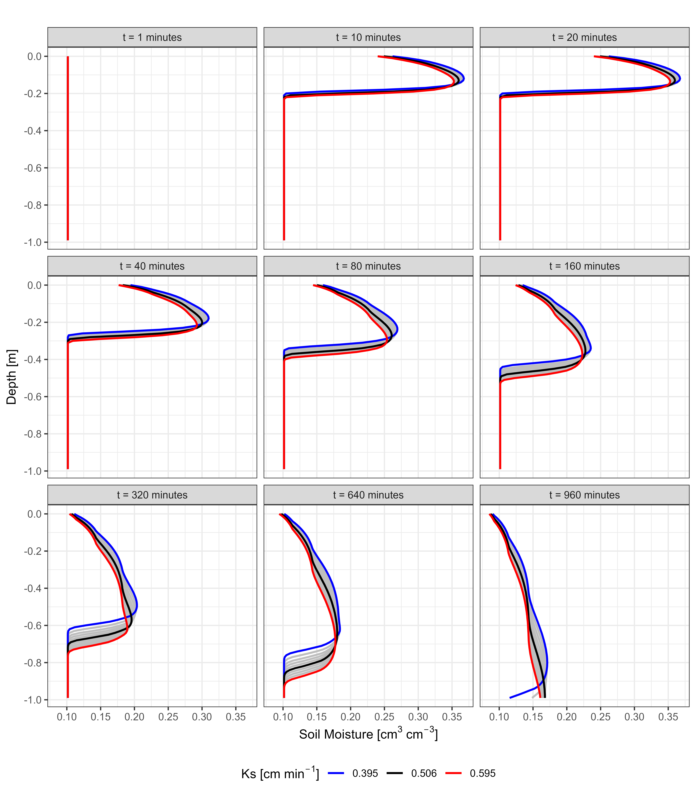

# Running multiple HYDRUS-1D simulations using R
Daliakopoulos, I., Asst. Professor, Department of Agriculture, Hellenic
Mediterranean University, Greece
2024-08-25

# Introduction

Hydrus-1D is a widely used numerical model developed for simulating
water, heat, and solute movement in variably saturated porous media such
as soil and hydroponic substrates. Its primary focus is on solving the
Richards equation for unsaturated flow, and it is capable of handling a
wide variety of soil profiles and boundary conditions, making it an
essential tool for researchers and engineers in the fields of hydrology,
soil science, and environmental engineering. One of the key applications
of Hydrus-1D is the simulation of soil moisture profiles, where it
models the distribution of water content through soil layers under
various conditions of infiltration, evaporation, and root uptake,
providing detailed insights into the subsurface flow processes (Šimůnek
et al., 2008).

Despite its robust capabilities for simulating single runs with precise
control over soil hydraulic properties and boundary conditions,
Hydrus-1D was not originally designed to support multiple simulations in
a Monte Carlo framework. This limitation poses challenges for users who
wish to assess the impact of uncertainty in soil parameters, such as
hydraulic conductivity ($Ks$) or soil water retention characteristics,
on the simulated soil profiles (e.g. Kontaxakis et al., 2023,
Papadimitriou et al., 2024). In such cases, researchers often need to
develop custom scripts or workflows such as the one provided by
Groenendyk (2014) and Diamantopoulos (2017) for MATLAB. Packages
`hydrusR` (Acharya, 2020) and `RHydrus` (Temple Lang, 2023) may also
support such workflows in R.

# Methodology

## Hydrus 1D

Hydrus-1D solves the Richards equation for water flow in unsaturated
soils, incorporating the van Genuchten-Mualem (vG-Mualem) equation to
describe the soil-water retention curve and hydraulic conductivity as a
function of soil moisture content. The vG-Mualem model is widely used
for describing the hydraulic properties of unsaturated porous media. The
soil-water retention function is given by:

$$
\theta(h) = \theta_r + \frac{\theta_s - \theta_r}{\left(1 + | \alpha h |^n \right)^m}
$$

where $\theta(h)$ is the volumetric water content at a given matric
potential $h$, $\theta_r$ and \$ \_s \$ are the residual and saturated
water contents, respectively, $\alpha$ is a parameter related to the
inverse of the air-entry suction, and $n$ and $m$ are empirical shape
parameters with $m = 1 - 1/n$.

The unsaturated hydraulic conductivity $K(\theta)$ is described by the
Mualem conductivity model:

$$
K(\theta) = K_s S_e^{l} \left[ 1 - \left( 1 - S_e^{1/m} \right)^m \right]^2
$$

where $K_s$ is the saturated hydraulic conductivity, $l$ is an empirical
pore-connectivity parameter, and $S_e$ is the effective saturation given
by:

$$
S_e = \frac{\theta - \theta_r}{\theta_s - \theta_r}
$$

The van Genuchten-Mualem model allows Hydrus-1D to simulate complex
soil-water dynamics with high accuracy across a wide range of soil types
and conditions (van Genuchten, 1980; Mualem, 1976). By incorporating
these equations, Hydrus-1D can model water flow in variably saturated
soils, accounting for the nonlinear relationship between soil moisture,
matric potential, and hydraulic conductivity.

## Automation in R

Here I use an R Quarto (R Core Team, 2021) script as a wrapper to
automate and manage multiple Hydrus-1D simulations. This approach
involves generating a separate directory for each simulation, with each
directory containing edited input files (Selector.in, Atmosph.in, and
PROFILE.dat) tailored to different soil hydraulic parameters. After
preparing the input files, Hydrus-1D is executed from the command line
using R’s `system` function, which enabled the seamless integration of
the external model into the R environment. The script supports both
single-processor execution for sequential runs and parallel processing
to accelerate the simulations using the `parallel` package (R Core Team,
2021). Once the simulations are completed, the results are collected and
visualized using the `ggplot2` package (Wickham, 2016). This allows for
the generation of plots illustrating soil moisture profiles over time,
facilitating the comparison of different scenarios and their outcomes
under varying soil conditions. The script can be found in Daliakopoulos
(2024).

# Case study

Let’s assume a 100 cm deep profile of sandy soil ($\theta_r$ = 0.045
$cm^3 cm^{-3}$, $\theta_s$ = 0.43 $cm^3 cm^{-3}$, $\alpha$ = 0.145
$cm^{-1}$, $n$ = 2.68, $l$ = 0.5, and $K_s$ = 0.495 $cm~min^{-1}$ with a
variance of 0.3 $cm min^{-1}$). Given a 10-minute irrigation event of 1
$cm min^{-1}$. 10 simulations along the range of $K_s$ provide enough
data to visualise the range of $\theta$ throughout the soil profile.
Figure 1 shows the value of $\theta$ for 9 timesteps (1, 10, 20, …, and
960 minutes) picked across the simulations.

# Conclusions and next steps

The script facilitates the visualisation of HYDRUS-1D results for simple
simulations of water trasnport is soils. Including more formal
read/write functions from the `hydrusR` package (Acharya, 2020) will
allow for higher diversity in the scenarios that can be simulated.

# References

Daliakopoulos, I. (2024). hydrus-soil-profile. Accessible online:
https://github.com/daliakopoulos/hydrus-soil-profile

Diamantopoulos, E. (2017). Running Hydrus (1D) in Matlab, PC-PROGRESS.
Accessible online:
https://www.pc-progress.com/Downloads/Tutorials/Matlab_RunningHydrus.pdf

Groenendyk, D. (2014). hydrus-batch-matlab. Accessible online:
https://github.com/MoonRaker/hydrus-batch-matlab

Kontaxakis, E., Papadimitriou, D., Daliakopoulos, I., Sabathianakis, I.,
Stavropoulou, A., & Manios, T. (2023). Water Availability in Pumice,
Coir, and Perlite Substrates Regulates Grapevine Growth and Grape
Physicochemical Characteristics in Soilless Cultivation of Sugraone and
Prime Cultivars (Vitis vinifera L.). *Agriculture*, 13(9), 1690.

Mualem, Y. (1976). A new model for predicting the hydraulic conductivity
of unsaturated porous media. *Water Resources Research*, 12(3), 513-522.

Papadimitriou, D. M., Daliakopoulos, I. N., Louloudakis, I., Savvidis,
T. I., Sabathianakis, I., Savvas, D., & Manios, T. (2024). Impact of
container geometry and hydraulic properties of coir dust, perlite, and
their blends used as growing media, on growth, photosynthesis, and yield
of Golden Thistle (S. hispanicus L.). *Scientia Horticulturae*, 323,
112425.

R Core Team (2021). R: A Language and Environment for Statistical
Computing. R Foundation for Statistical Computing, Vienna, Austria.

Šimůnek, J., Šejna, M., & van Genuchten, M. T. (2008). The Hydrus-1D
Software Package for Simulating the Movement of Water, Heat, and
Multiple Solutes in Variably-Saturated Media. U.S. Salinity Laboratory,
USDA, Riverside, California.

Acharya, S. (2020). hydrusR. Available online:
https://github.com/shoebodh/hydrusR

Temple Lang, D. (2023). RHydrus. Available online:
https://github.com/mespe/RHydrus

van Genuchten, M. Th. (1980). A closed-form equation for predicting the
hydraulic conductivity of unsaturated soils. *Soil Science Society of
America Journal*, 44(5), 892-898.

Wickham, H. (2016). ggplot2: Elegant Graphics for Data Analysis.
Springer-Verlag New York.
